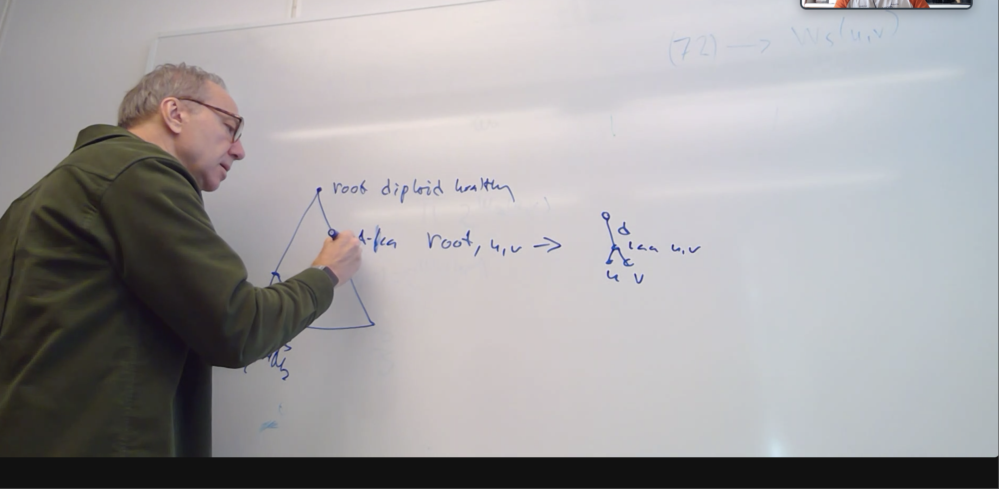

# Implementation notes

## Initialization
> see repo [GitHub link](https://github.com/negar7918/CopyMix/tree/master) and see specially the Gaussian folder

[DIC](https://en.wikipedia.org/wiki/Deviance_information_criterion) - elbow method (alternative to BIC)
## Viterbi
in util.py

After Viterbi it's possible to fit the HMM with EM algorithm (there is both Baum Welch - inefficient - and independent site EM inference)

MLE for Initialization of the gaussian parameters
$mu_0 <- mean(data)$
$lambda_0 <- 1 / var(data)$ 

## Evaluation
in util.py
V-measure for clustering
Total variation for copy numbers (useful also for comparison)

### Comparison wrt other methods (state of the art)
- don't use Robinson-Ford (not fair)

## Tree sampling

Start with edmonds
- infinity for edge that must be included, 0 for edge over the cut (when not included)
- use `Edmonds.find_optimum()` from `networkx`

## EM algorithm

## Meeting 9/12

- visit
- data
- work
  1. VI-C-Tree
    - markov models over trees
  2. sc-EM-Tree
    - EM algorithm to estimate $\epsilon$
    - tree reconstruction algorithm (recursive)
